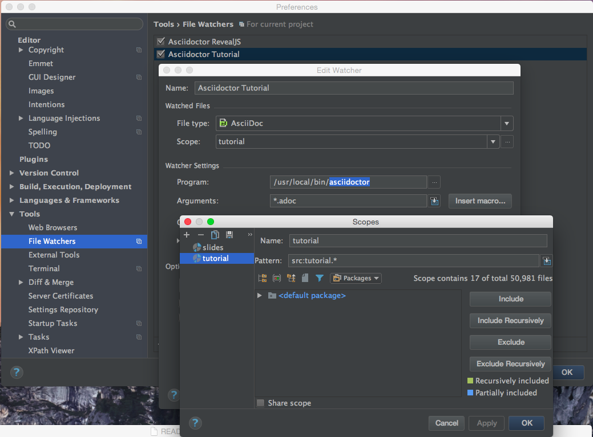

= Clojure Meetup

== Slides

The slides use the Reveal.js presentation framework (http://lab.hakim.se/reveal-js). The content is written in Asciidoc (http://asciidoc.org/) and transformed into HTML using Assciidoctor (http://asciidoctor.org/). Follow the instructions on https://github.com/asciidoctor/asciidoctor-reveal.js to install the tool chain.

Render the HTML file from the `*.adoc` files in `resources/slides` (invoked from the project folder) using

   bundle exec asciidoctor-revealjs resources/slides/*.adoc

== Tutorial

The HTML pages of the tutorial are also written in Asciidoc using the Asciidoctor toolchain. The interactive code evaluation is done by the KLIPSE framework (https://github.com/viebel/klipse).

Render the HTML file from the `*.adoc` files in `resources/tutorial` (invoked from the project folder) using

   asciidoctor resources/tutorial/*.adoc

== IntelliJ Workflow

The IntelliJ IDEA (https://www.jetbrains.com/idea/) can trigger the rendering on file change. Make sure you have the File Watchers plugin installed (available directly from JetBrains).

The following screenshot shows the settings I use. Each command (one for slides and one for the tutorial) is invoked only within its scope.

